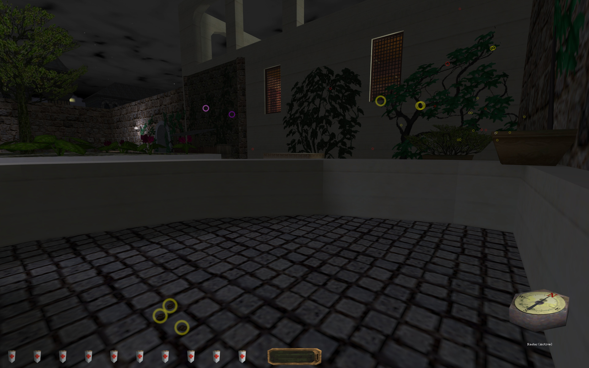

# X-Raydar (Thief 1/Gold/2; System Shock 2)

Useful in finding hidden things, or those pesky little coins.



Which items are detected, if any, depends on which of the optional extras you install. If you install none, the radar is pretty useless. Install one or more extras based on the kinds of items you'd like to detect. Installing or removing these extras will require starting a new game, as with installing or removing the mod in general.

Some items work with multiple radar types. For example, loot in a chest will be detected with either the loot radar or the container radar. Likewise, a purse on a belt will be detected both by the loot radar and the pickpocket radar.

## Thief Details

When this mod is installed, a compass-like item will be put in your inventory during every mission. Use this inventory item to show or hide the location of nearby points of interest.

Indicator colors:
* Yellow: Loot.
* Green: Equipment.
* Red: Creatures.
* Pink: Secrets and objectives. Only some objectives can be detected and highlighted, and basically nothing in Thief 1/Gold original missions.
* Purple: Devices, like buttons, lockboxes, and pressure plates.
* Light Blue: Books and similar readables.
* White: Anything that doesn't fall into another category.

### Dark Mod Manager Installation (Recommended)

See [installation instructions](Installation%20and%20Removal.md) for details.

**Keybind item name** ([What's this?](Keybinds.md)): j4fradarcontrolitem

#### All-in-One Version

You can install a single mod with *all* optional components enabled. If you use this file, you *don't* need the base mod or the point-of-interest mods.

* [J4F-radar_all_in_one.7z](https://github.com/saracoth/newdark-mods/releases/latest/download/J4F-radar_all_in_one.7z)

#### Customized Version

This approach is best if you want, say, a loot-only radar. Install the base mod, plus any desired points of interest. See [installation instructions](Installation%20and%20Removal.md) for details. The base mod should have a higher priority than the POI mods. Other than that, the priorities don't matter.

**Base Mod**: [J4F-radar_1_base.7z](https://github.com/saracoth/newdark-mods/releases/latest/download/J4F-radar_1_base.7z)

**Points of Interest**: Install one or more of these, as desired.
* [J4F-radar_2_loot.7z](https://github.com/saracoth/newdark-mods/releases/latest/download/J4F-radar_2_loot.7z) for loot.
* [J4F-radar_2_allequip.7z](https://github.com/saracoth/newdark-mods/releases/latest/download/J4F-radar_2_allequip.7z) for equipment. Arrow crystals, keys and other inventory items, etc.
* [J4F-radar_2_questsecret.7z](https://github.com/saracoth/newdark-mods/releases/latest/download/J4F-radar_2_questsecret.7z) for secrets and objectives. Secrets are counted in the end-of-mission stats in Thief 2. Objectives also tend to work only in Thief 2 or in FMs, and not all objectives are detectable.
* [J4F-radar_2_creature.7z](https://github.com/saracoth/newdark-mods/releases/latest/download/J4F-radar_2_creature.7z) to detect hostile creatures, or [J4F-radar_2_creature_all.7z](https://github.com/saracoth/newdark-mods/releases/latest/download/J4F-radar_2_creature_all.7z) to detect all creatures.
* [J4F-radar_2_device.7z](https://github.com/saracoth/newdark-mods/releases/latest/download/J4F-radar_2_device.7z) for devices like buttons, lockboxes, and pressure plates.
* [J4F-radar_2_readable.7z](https://github.com/saracoth/newdark-mods/releases/latest/download/J4F-radar_2_readable.7z) for books and similar readables. Fullscreen stuff, not name plates. Previously read items are ignored.
* [J4F-radar_2_pickpocket.7z](https://github.com/saracoth/newdark-mods/releases/latest/download/J4F-radar_2_pickpocket.7z) for pickpocketable items. Since coin purses count as loot and arrows count as equipment, this addon is mostly useful to find weird pickpocket targets.
* [J4F-radar_2_container.7z](https://github.com/saracoth/newdark-mods/releases/latest/download/J4F-radar_2_container.7z) for non-empty containers. Since items can already be detected inside containers, this addon is mostly useful for finding miscellaneous junk.

### Manual Installation

See [installation instructions](Installation%20and%20Removal.md) for details.

It would be easiest to extract the all-in-one file to a folder somewhere, then delete any unwanted DML files from the dbmods folder. Any DML file named "just4fun_radar_0X" should be kept, and any DML files named "just4fun_radar_1X" or "just4fun_radar_2X" can be deleted if you don't want them.

## System Shock 2 Details

The radar is active by default.

### Keybinding

Toggle controls are possible, but currently a bit of a pain. A future update might add a radar toggle button to the inventory UI somewhere. In the meanwhile, you could try manually adding a keybind. System Shock 2 instructions are similar to [Thief keybinds](Keybinds.md), but you'll use a `summon_obj` command instead. Note that `summon_obj` commands only work when your player character has access to their inventory and other controls. This same command is used to create navigation markers on your map in the vanilla game.

```
bind r+ctrl "summon_obj j4fshockdarcontrolitem"
```

Indicator colors:
* Yellow: Nanites and most slotless/unlimited inventory. Includes installable software.
* Green: Cyber module items and reward triggers. Until delivered, reward triggers appear in the empty air or attached to a keypad or other device.
* Red: Creatures.
* Pink: Stackable inventory, like ammo and hypos.
* Purple: Unstackable inventory, like weapons and armor.
* Light Blue: Audio log objects and e-mail triggers. Triggers appear in empty air until delivered.
* White: Anything that doesn't fall into another category.

### Dark Mod Manager Installation (Recommended)

See [installation instructions](Installation%20and%20Removal.md) for details.

**Keybind item name** ([What's this?](Keybinds.md)): j4fshockdarcontrolitem (use `summon_obj` instead of `inv_select`)

#### All-in-One Version

You can install a single mod with *all* optional components enabled. If you use this file, you *don't* need the base mod or the point-of-interest mods.

* [J4F-radar_all_in_one.7z](https://github.com/saracoth/newdark-mods/releases/latest/download/J4F-radar_all_in_one.7z)

#### Customized Version

This approach is best if you want, say, a loot-only radar. Install the base mod, plus any desired points of interest. See [installation instructions](Installation%20and%20Removal.md) for details. The base mod should have a higher priority than the POI mods. Other than that, the priorities don't matter.

**Base Mod**: [J4F-radar_1_base.7z](https://github.com/saracoth/newdark-mods/releases/latest/download/J4F-radar_1_base.7z)

**Points of Interest**: Install one or more of these, as desired.
* [J4F-radar_2_cybermodule.7z](https://github.com/saracoth/newdark-mods/releases/latest/download/J4F-radar_2_cybermodule.7z) for cybermodules.
* [J4F-radar_2_nanite.7z](https://github.com/saracoth/newdark-mods/releases/latest/download/J4F-radar_2_nanite.7z) for nanites.
* [J4F-radar_2_allequip.7z](https://github.com/saracoth/newdark-mods/releases/latest/download/J4F-radar_2_allequip.7z) for all equipment. Alternately, install one or more of the following for specific kinds of equipment.
	* [J4F-radar_2_equip_unlimited.7z](https://github.com/saracoth/newdark-mods/releases/latest/download/J4F-radar_2_equip_unlimited.7z) for things like keycards, repair software, game cartridges, etc.
	* [J4F-radar_2_equip_stackable.7z](https://github.com/saracoth/newdark-mods/releases/latest/download/J4F-radar_2_equip_stackable.7z) for things like hypos, ammo, repair tools, etc.
	* [J4F-radar_2_equip_unstackable.7z](https://github.com/saracoth/newdark-mods/releases/latest/download/J4F-radar_2_equip_unstackable.7z) for weapons, armor, power cells, etc.
* [J4F-radar_2_creature.7z](https://github.com/saracoth/newdark-mods/releases/latest/download/J4F-radar_2_creature.7z) to detect hostile creatures, or [J4F-radar_2_creature_all.7z](https://github.com/saracoth/newdark-mods/releases/latest/download/J4F-radar_2_creature_all.7z) to detect all creatures.
* [J4F-radar_2_readable.7z](https://github.com/saracoth/newdark-mods/releases/latest/download/J4F-radar_2_readable.7z) for audio logs and e-mails.
* [J4F-radar_2_container.7z](https://github.com/saracoth/newdark-mods/releases/latest/download/J4F-radar_2_container.7z) for non-empty containers. Since items can already be detected inside containers, this addon is mostly useful for finding miscellaneous junk.

### Manual Installation

See [installation instructions](Installation%20and%20Removal.md) for details.

It would be easiest to extract the all-in-one file to a folder somewhere, then delete any unwanted DML files from the dbmods folder. Any DML file named "just4fun_radar_0X" should be kept, and any DML files named "just4fun_radar_1X" or "just4fun_radar_2X" can be deleted if you don't want them.

## Modder's Notes

This mod uses the same scripting features someone would use to create new HUD elements. Instead of positioning them on specific parts of the screen, these overlays are created, destroyed, and repositioned to match the location of objects in the game world.

There's a ton of code to handle corner cases, like "don't inherit" objects we cannot safely script directly, or broken Links caused by System Shock 2 level transitions. In addition to using metaproperties directly where able, the mod also scans every object at mission start to flag items of interest. At least on my machine, none of this processing results in FPS drops. Some processes are capped or staggered over time to help keep it that way.

It's not likely most mods need anything like this, but this also demonstrates creating a overlay-based mod that functions in both Thief-like and Shock-like games.