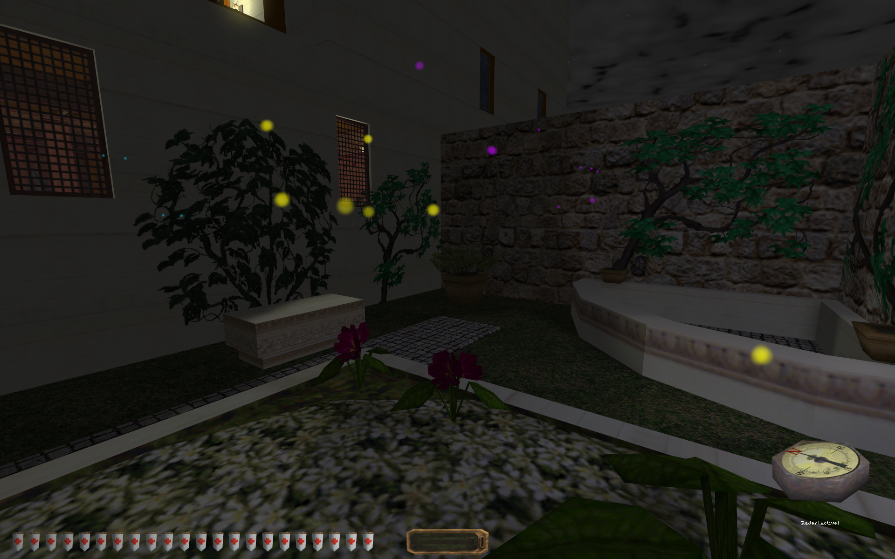

# Radar (Thief 1/Gold/2)

When this mod is installed, a compass-like item will be put in your inventory during every mission. Use this inventory item to show or hide the location of nearby points of interest. Can be useful in finding hidden things, or those pesky little coins.

Which items are detected, if any, depends on which of the optional extras you install. If you install none, the radar is pretty useless. Install one or more extras based on the kinds of items you'd like to detect. Installing or removing these extras will require starting a new game, as with installing or removing the mod in general.

Some items work with multiple radar types. For example, loot in a chest will be detected with either the loot radar or the container radar. Likewise, a purse on a belt will be detected both by the loot radar and the pickpocket radar.

**Required files** (see [installation instructions](Installation%20and%20Removal.md)):
* [dbmods\just4fun_radar_00_base.dml](../dbmods/just4fun_radar_00_base.dml?raw=1)
* [dbmods\miss_all\just4fun_radar_ui.dml](../dbmods/miss_all/just4fun_radar_ui.dml?raw=1)
* [sq_scripts\just4fun_radar_00_base.nut](../sq_scripts/just4fun_radar_00_base.nut?raw=1)
* [j4fRes\Radar*.png](../j4fRes) (All the radar files. Consider downloading the entire github repo as a zip file to make downloading these easier.)

**Optional loot detection**: Yellow indicators.
* [dbmods\just4fun_radar_10_lootdar.dml](../dbmods/just4fun_radar_10_lootdar.dml?raw=1)

**Optional equipment detection (keys, arrows, potions, etc.)**: Green indicators.
* [dbmods\just4fun_radar_10_equipdar.dml](../dbmods/just4fun_radar_10_equipdar.dml?raw=1)
* [dbmods\just4fun_radar_11_T1_equip.dml](../dbmods/just4fun_radar_11_T1_equip.dml?raw=1)
* [dbmods\just4fun_radar_11_T2_equip.dml](../dbmods/just4fun_radar_11_T2_equip.dml?raw=1)

**Optional readable detection (books, scrolls, etc.)**: Blue indicators. Ignores previously read items.
* [dbmods\just4fun_radar_10_bookdar.dml](../dbmods/just4fun_radar_10_bookdar.dml?raw=1)

**Optional creature detection (guards, robots, cameras, etc.)**: Red indicators. Ignores dead and knocked-out creatures. Ignores nonhostile creatures (allies, rats, etc.)
* [dbmods\just4fun_radar_10_creaturedar.dml](../dbmods/just4fun_radar_10_creaturedar.dml?raw=1)

**Optional device detection (switches, pressure plates, etc.)**: Purple indicators.
* [dbmods\just4fun_radar_10_devicedar.dml](../dbmods/just4fun_radar_10_devicedar.dml?raw=1)

**Optional container detection (chests, lockboxes, etc.)**: White indicators. Ignores empty containers.
* [dbmods\just4fun_radar_10_containerdar.dml](../dbmods/just4fun_radar_10_containerdar.dml?raw=1)

**Optional pickpocketable detection (purses, quivers, etc.)**: White indicators.
* [dbmods\just4fun_radar_10_pocketdar.dml](../dbmods/just4fun_radar_10_pocketdar.dml?raw=1)

*Modder's Notes*: This mod uses the same scripting features someone would use to create new HUD elements. Instead of positioning them on specific parts of the screen, these overlays are created, destroyed, and repositioned to match the location of objects in the game world. There's a ton of code to handle corner cases, like "don't inherit" objects we cannot safely script directly. The [original version](https://github.com/saracoth/newdark-mods/tree/original) of this mod uses as little scripting as possible, instead creating visible particle effects to indicate nearby items of interest.