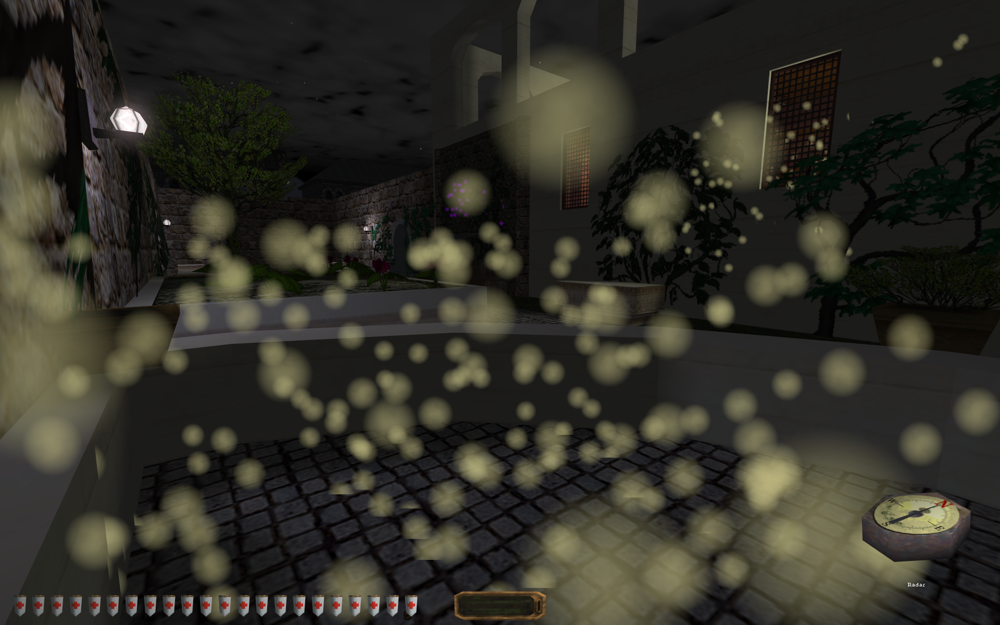

# Radar (Thief 1/Gold/2)

When this mod is installed, a compass-like item will be put in your inventory during every mission. Use this inventory item to "ping" nearby items of interest. Can be useful in finding hidden things, or those pesky little coins.

When an item is detected, a particle effect will explode out from it. Lag spikes can happen if there are lots and lots of items detected nearby.

Which items are detected, if any, depends on which of the optional extras you install. If you install none, the radar is pretty useless. Install one or more extras based on the kinds of items you'd like to detect. Installing or removing these extras will require starting a new game, as with installing or removing the mod in general.

**Required files** (see [installation instructions](Installation%20and%20Removal.md)):
* dbmods\just4fun_radar_00_base.dml
* sq_scripts\just4fun_radar_00_base.nut

**Optional loot detection**:
* dbmods\just4fun_radar_10_lootdar.dml
* sq_scripts\just4fun_radar_10_lootdar.nut

**Optional equipment detection (arrows, potions, keys, etc.)**:
* dbmods\just4fun_radar_10_equipdar.dml
* dbmods\just4fun_radar_11_T1_equip.dml
* dbmods\just4fun_radar_11_T2_equip.dml
* sq_scripts\just4fun_radar_10_equipdar.nut

**Optional device detection (switches, pressure plates, etc.)**:
* dbmods\just4fun_radar_10_devicedar.dml
* sq_scripts\just4fun_radar_10_devicedar.nut

**Optional container detection (chests, lockboxes, etc.)**:
* dbmods\just4fun_radar_10_containerdar.dml
* dbmods\just4fun_radar_11_T1_containers.dml
* dbmods\just4fun_radar_11_T2_containers.dml
* sq_scripts\just4fun_radar_10_containerdar.nut

*Modder's Notes*: This mod demonstrates creating new objects in the game world, positioned on top of arbitrary targets. The loot radar is more complex than the others, because we're trying to avoid the unsafe approach of adding a script directly to the existing IsLoot metaproperty. The [original version](https://github.com/saracoth/newdark-mods/tree/original) of this mod uses as little scripting as possible. As a result, it lacks some features of the current mod.